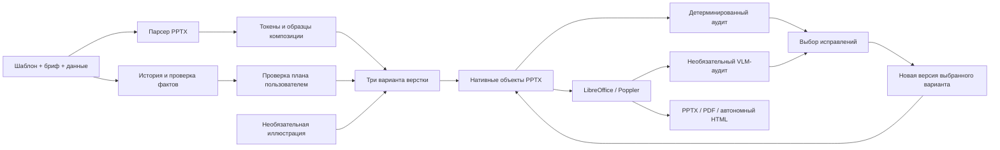

# Архитектура цифрового дизайнера

Версия workflow находится в `agents/designer.toml`, версия контрактов — `1.0`.

## Границы слоёв

| Слой | Реализация | Ответственность |
| --- | --- | --- |
| Интерфейс | `frontend/`, `exposlides/studio_static/` | React/TS: материалы, план, сравнение, аудит |
| Локальный API | `exposlides/studio.py` | Ограниченная очередь, задания, версии, файлы |
| Оркестрация | `exposlides/design_pipeline.py` | Общий дедлайн, отмена, отдельные процессы |
| Разбор | `services/parsing-service/app/parsers/pptx/` | PPTX → подробный Presentation JSON |
| Профиль | `exposlides/template_profile.py` | Токены, слоты, защищённые области, образцы |
| История | `app.design_main`, `exposlides/design_content.py` | DesignRequest → ContentPlan, факты и ссылки |
| Иллюстрации | `app.design_image` | Необязательная картинка и provenance, одна для трёх вариантов |
| Верстка | `exposlides/design_layout.py` | Один ContentPlan → три DeckPlan |
| PPTX | `design_builder.py`, `design_pptx_parts.py`, `design_smartart.py` | Проверенный редактируемый файл |
| Аудит | `exposlides/design_audit.py`, `exposlides/design_saved_audit.py`, `app.design_audit` | План, фактический файл, кадры → AuditReport |
| Экспорт | `exposlides/design_export.py`, `preview.py` | Тот же PPTX → PDF, PNG/SVG, HTML |

Пакет `app` повторяется в сервисах. Оркестратор запускает их отдельными процессами
с собственным рабочим каталогом, не смешивая service roots в `sys.modules`.
Чистый модуль grounding загружается под отдельным именем без импорта всего сервиса.

## Контракты и воспроизводимость

`design_models.py` содержит строгие Pydantic-модели: запрещены неизвестные поля и
бесконечные числовые значения. Новый контракт не переопределяет старый placeholder pipeline.

`StorySlide.id` обозначает единицу истории, `SlideInstance.id` — выходной слайд,
`source_slide_index` — 1-based образец шаблона. Один образец используется многократно.
`PlacedBlock.id` уникален в колоде, переносится в имя фигуры `exposlides:<id>` и связывает
аудит с объектом готового PPTX.

Исходные абзацы получают стабильные `source-N` и диапазоны символов. Простое перечисление
всех ссылок не считается покрытием: содержание каждого раздела сопоставляется с
приписанными ему слайдами. Числа, знак, единицы, период, показатели, отрицания и обязательные
сообщения проверяются консервативными правилами. Произвольное семантическое доказательство
корректности не заявляется.

Промпты находятся в `prompts/designer/`, роли — в `agents/designer.toml`, лицензии и
лимиты моделей — в `config/models.toml`. Runtime читает эти файлы. Manifest фиксирует
версии/SHA-256 ресурсов, хеши шаблона, исходного текста и полного request.json с данными
и настройкой иллюстрации, режим и запрос контекстуального аудита. Для LLM-плана адаптер
сохраняет story-provenance.json; разрешённые поля попадают в manifest.story_model,
включая модель, использованный endpoint_model, лицензию и хеш промпта. В extractive-режиме
story_model равен null. Указанный alias не аттестует модель за удалённым endpoint.
Проверенные планы и аудит сохраняются в задании; журнал всех сырых ответов модели
не гарантируется. Seed не гарантирует одинаковую картинку у разных провайдеров; локальная верстка
по одному плану детерминирована.

Программные навыки и их версии находятся в `config/skills.toml`; детерминированный
аудитор читает оттуда пороги плотности и контраста. Полный запуск из одного TOML
обслуживает `exposlides.run_config`. Заметки докладчика также проходят grounding,
но не засчитываются вместо видимого содержания слайдов.

## Три варианта и неизвестные шаблоны

История, факты, порядок и данные общие. Ось различий — композиция: рассказ,
доказательства и карточки. Меняются ширина/расположение блоков, колонки, акцентные
заливки и положение визуализации. Один набор данных может показываться таблицей
или нативным графиком.

Распознавание использует координаты, темы masters, наследуемую типографику, обычные
text boxes/placeholders, повторяющиеся края/колонтитулы и защищённые фигуры. Имена
конкретных конкурсных шаблонов в алгоритме отсутствуют. Несовместимые образцы дают
явные ограничения. Универсальная поддержка любых авторских композиций не доказана.

## Нативная сборка

Builder клонирует слайды и независимые изменяемые части: диаграммы, встроенные книги,
заметки, SmartArt. Неизменяемые layouts/темы/медиа могут разделяться. Внутренние ссылки
переназначаются; ссылка на исключённый слайд приводит к ошибке. Шаблоны с custom shows
или sections отклоняются. Тайминги анимации удаляются: новая колода статическая. Private OOXML-операции
изолированы и покрыты fixture-тестами.

После сохранения проверяются ZIP, разрешимость внутренних relationships и повторное
открытие через python-pptx. Аудит сопоставляет имена объектов, layout и защищённые
элементы с исходником. Process/comparison — группы фигур; SmartArt — ограниченный
путь повторного применения совместимого нативного образца.

## Версии, время и отказы

Планирование и сборка разделены пользовательской проверкой. Активное время ограничено
300 секундами; процессы и конвертеры получают общий дедлайн. Исправление имеет отдельный
бюджет 120 секунд. Планирование, сборка и исправления используют общий атомарный лимит
восемь активных заданий: queued, running и cancelling. При заполненной очереди API
возвращает 429 до изменения готового плана или опубликованного результата. Отменённая
работа занимает место до подтверждения остановки worker. Работают два workers; сборки и правки сериализованы
целиком, включая конвертацию. Отмена завершает дочерние процессы. После перезапуска
незавершённые задания становятся failed.

Версия публикуется переименованием временного каталога после экспорта и аудита.
Неудачная правка сохраняет предыдущую версию. При ошибке последующей сборки уже
опубликованные варианты сохраняются и доступны в студии, но задача не считается
успешно завершённой. Исправления ограничены безопасными
операциями и отклоняются при новых критических геометрических замечаниях. Отключённый
аудит отличается от неуспешного модельного вызова.

## Локальная безопасность и сетевые сервисы

Студия проверяет Host/Origin, требует session token для изменений, ограничивает размер
запроса и распакованного PPTX, разрешает скачивать только опубликованные форматы.

Список заданий, шаблоны, действия и файлы проверяют владельца по постоянному случайному
HttpOnly-cookie браузера. Чужие и старые задания без владельца не раскрываются API.
Extractive-режим с выключенными модельными этапами не отправляет материалы в сеть.
Контекстуальный аудит отправляет провайдеру кадры и относящиеся к ним материалы.

Gateway/Kafka/file-service обслуживают отдельный workflow. Для него добавлены ownership
файлов, атомарные переходы задач, повторные события и commit обработанных partitions.
Это не означает подключения новой студии к Kafka или эксплуатационной проверки кластера.

Многопользовательское развёртывание требует отдельной аутентификации, пользовательской
изоляции хранилища, эксплуатационных лимитов/retention и живого прогона инфраструктуры.
Документ описывает исполняемую локальную архитектуру и её границы.
