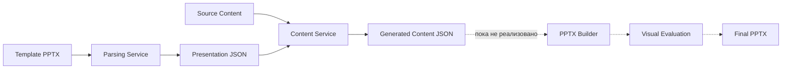
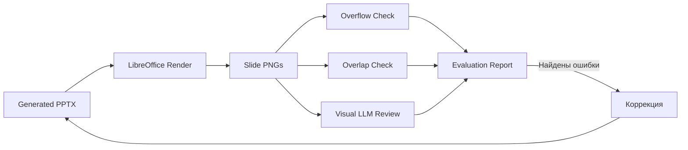
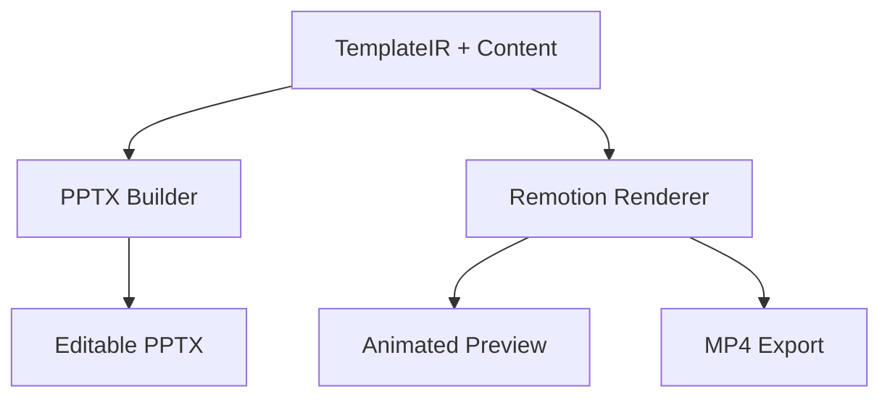

# ExpoSlides — обзор реализации и план развития

> Технический обзор ветки `dev`: текущее состояние, оценка готовности и приоритеты для хакатонного MVP.

**Статус:** `Pre-MVP`  
**Дата обзора:** 26 августа 2026  
**Область оценки:** parsing-service, content-service, сквозная генерация, качество результата и готовность проекта к демонстрации

---

## Executive summary

ExpoSlides движется в правильном направлении: вместо одного большого промпта проект строит полноценный AI-пайплайн с отдельной моделью презентации, анализом PPTX, планированием структуры и генерацией контента.

На текущем этапе реализован хороший фундамент двух первых стадий — **парсинг шаблона** и **подготовка текстового контента**. Однако главный пользовательский сценарий пока не замкнут: проект ещё не создаёт итоговый PPTX и не проверяет его визуальное качество.

> [!IMPORTANT]
> Ближайшая цель — получить воспроизводимый сценарий `template.pptx + content → result.pptx`. До его появления инфраструктурные задачи вроде Kafka, gRPC и MinIO не должны быть основным приоритетом.

### Текущий пайплайн



---

## Что уже реализовано

### 1. Parsing-service

Базовый анализ PPTX реализован через `python-pptx` и собственные Pydantic-модели.

Сервис извлекает:

- размеры презентации;
- список слайдов и layouts;
- координаты, размеры и порядок элементов;
- текстовые блоки, абзацы и отдельные runs;
- базовые параметры текста: шрифт, размер, цвет, жирность, курсив и подчёркивание;
- изображения и таблицы;
- placeholders и их индексы;
- фон слайда;
- основные цвета и шрифты темы;
- заметки докладчика;
- базовый семантический тип слайда.

Результат преобразуется в структурированную модель `Presentation`, которую можно использовать как основу промежуточного представления шаблона.

### 2. Content-service

Реализован LLM-пайплайн на LangGraph:


В текущей реализации присутствуют:

- отдельные этапы анализа, планирования, генерации и валидации;
- GigaChat-клиент;
- структурированный ответ LLM по JSON Schema;
- Pydantic-модели входных данных, состояния графа и результата;
- пользовательская подстановка контента;
- ограниченный retry-цикл;
- логирование;
- локальный сценарий запуска с `template.json` и `script.txt`.

### 3. Архитектурная подготовка

В репозитории предусмотрены отдельные компоненты для:

- builder-service;
- evaluation-service;
- vision-service;
- file-service;
- API gateway;
- Kafka;
- protobuf-контрактов.

В `DEVDOCK.md` описан подробный план развития системы. Пока эти компоненты являются заготовками и не участвуют в рабочем сценарии.

---

## Оценка реализации

| Область | Оценка | Статус | Комментарий |
|---|:---:|:---:|---|
| Архитектурная идея | **7/10** | 🟢 | Правильное разделение стадий и наличие промежуточной модели |
| PPTX-парсер | **5/10** | 🟡 | Хорошая база, но дизайн-система извлекается не полностью |
| Content pipeline | **5/10** | 🟡 | Осмысленный граф, но присутствуют ограничения модели данных и retry |
| Генерация PPTX | **0/10** | 🔴 | Builder пока отсутствует |
| Визуальная проверка | **0/10** | 🔴 | Нет рендера, проверки переполнений и пересечений |
| Воспроизводимость | **2/10** | 🔴 | Не заполнены зависимости, Dockerfiles и Compose |
| Готовность к демонстрации | **3/10** | 🔴 | Можно показать промежуточный JSON, но не конечный продукт |
| Соответствие полному ТЗ | **4/10** | 🟡 | Реализовано начало двух стадий, основной сценарий ещё не закрыт |

### Итоговая оценка

**Хороший технический каркас, находящийся на стадии pre-MVP.**

Сильнейшая сторона проекта — правильная декомпозиция задачи. Главный недостаток — отсутствие готового артефакта, который можно открыть, отредактировать и показать пользователю.

---

## Что сделано хорошо

1. **Задача не сведена к prompt engineering.** Проект пытается извлекать структуру шаблона и строить управляемый pipeline.
2. **Есть типизированная модель данных.** Это создаёт основу для builder, evaluation и нескольких вариантов рендера.
3. **LLM возвращает структурированный результат.** JSON Schema снижает количество ошибок интеграции.
4. **Этапы генерации разделены.** Анализ, планирование и заполнение слайдов можно развивать независимо.
5. **Команда видит полную картину.** В roadmap уже отражены сборка PPTX, визуальная оценка и интеграция.

---

## Критические ограничения

### 1. Нет сквозной генерации

Система завершается на JSON с текстами и пока не формирует итоговый PPTX. Это основной блокер для демонстрации и проверки гипотезы продукта.

### 2. Новый слайд связан с индексом слайда-образца

Сгенерированный контент хранится по `template_slide_index`. Если один исходный паттерн будет выбран для нескольких новых слайдов, результаты начнут перезаписывать друг друга.

Необходимо разделить идентификатор результата и источник дизайна:

```json
{
  "output_slide_id": "slide-07",
  "order": 7,
  "source_slide_index": 3,
  "pattern_type": "title_and_image"
}
```

### 3. Content-service видит только placeholders

Обычные text boxes не участвуют в генерации контента. В дизайнерских шаблонах значительная часть текста может находиться именно в обычных фигурах, поэтому такие шаблоны будут анализироваться неполно.

### 4. Retry не использует обратную связь

Ошибки валидации вычисляются и передаются в форматирование промпта, но сам промпт не содержит поля для этих ошибок. Повторная генерация фактически получает те же инструкции и может воспроизводить тот же результат.

### 5. Ограничения текста оцениваются приблизительно

Допустимая длина определяется относительно длины исходного текста. Такой подход не учитывает:

- геометрию блока;
- размер и метрики шрифта;
- межстрочный интервал;
- количество абзацев;
- реальные переносы строк.

Надёжная проверка возможна только после сборки и рендеринга слайда.

### 6. Дизайн-система извлекается не полностью

Пока отсутствует полноценная поддержка:

- наследования от slide master и layout;
- групп элементов;
- диаграмм и графиков;
- стилей фигур и линий;
- градиентов, прозрачности и теней;
- crop и позиционирования изображений;
- извлечения и повторного использования реальных image assets.

### 7. Проект нельзя воспроизводимо запустить

Не заполнены или не готовы:

- `requirements.txt` сервисов;
- Dockerfiles;
- `docker-compose.yaml`;
- корневой README с quick start;
- тестовые fixtures;
- автоматические тесты;
- open-source лицензия.

### 8. Небезопасная конфигурация TLS

В LLM-клиенте отключена проверка SSL-сертификатов. Для локального прототипа это может временно упрощать настройку, но такая конфигурация не должна попасть в итоговое решение.

---

## Что необходимо реализовать

### Этап 1 — работающий MVP

#### PPTX Builder

- открыть исходный шаблон;
- клонировать выбранные слайды-образцы;
- сформировать новый порядок слайдов;
- заменить текст и изображения;
- сохранить исходные стили и геометрию;
- записать корректный `result.pptx`.

#### Корректная модель слайда

- отделить `output_slide_id` от `source_slide_index`;
- хранить порядок слайдов явно;
- разрешить многократное использование одного паттерна;
- хранить роли и ограничения каждого контентного слота.

#### Поддержка элементов

- placeholders;
- обычные text boxes;
- изображения;
- таблицы;
- метрики;
- подписи;
- базовые графики.

### Этап 2 — TemplateIR

Стоит сформировать единое промежуточное представление:

```json
{
  "design_tokens": {
    "colors": {},
    "fonts": {},
    "spacing": {}
  },
  "assets": [],
  "slide_patterns": [],
  "content_slots": [],
  "constraints": {}
}
```

TemplateIR должен стать контрактом между парсером, LLM-планировщиком, PPTX-builder и дополнительными renderers.

### Этап 3 — визуальная проверка



Минимальные проверки:

- переполнение текстовых блоков;
- пересечения элементов;
- пустые обязательные слоты;
- выход элементов за границы слайда;
- соответствие количества и порядка слайдов плану.

### Этап 4 — воспроизводимость

- заполнить зависимости;
- добавить CLI-команду;
- подготовить README с запуском менее чем за пять минут;
- добавить `.env.example`;
- собрать Docker-окружение;
- добавить unit- и integration-тесты;
- приложить три демонстрационных результата;
- добавить open-source лицензию.

---

## Анимации через Remotion

Remotion целесообразно использовать как дополнительный renderer после появления рабочего PPTX-builder.



Такой подход позволяет сохранить два сценария:

- **редактируемый PPTX** для пользователя;
- **анимированный preview или MP4** для демонстрации и публикации.

Для Remotion потребуется:

- React-компонент для каждого типа слайда;
- преобразование TemplateIR в props;
- библиотека безопасных анимационных пресетов;
- Remotion Player для preview;
- экспорт MP4;
- синхронизация контента между PPTX и анимированной версией.

Пример описания анимации в данных:

```json
{
  "preset": "fade-up",
  "duration": 0.6,
  "stagger": 0.15
}
```

Рекомендуемые пресеты:

- `fade`;
- `fade-up`;
- `slide-left`;
- `scale-in`;
- последовательное появление списка;
- анимация числовых метрик;
- постепенное построение графиков.

> [!NOTE]
> Remotion не заменяет PPTX-builder: его анимации остаются в web-preview или видео и не превращаются в редактируемые PowerPoint-анимации.

---

## Приоритетный roadmap

```text
1. Сквозной template.pptx → result.pptx
2. Корректное переиспользование паттернов
3. Поддержка text boxes, изображений и таблиц
4. Рендеринг и автоматическая проверка результата
5. Проверка на трёх шаблонах
6. CLI, README, зависимости и тесты
7. Remotion preview и MP4
8. Kafka, gRPC и масштабирование
```

### Definition of Done для MVP

MVP можно считать готовым, когда из чистого checkout одной документированной командой:

1. принимаются произвольный PPTX-шаблон и набор контента;
2. создаётся новая презентация с новым количеством и порядком слайдов;
3. один паттерн можно переиспользовать несколько раз;
4. результат открывается в PowerPoint или LibreOffice;
5. текст и основные элементы остаются редактируемыми;
6. автоматически создаются preview-изображения;
7. отсутствуют критические переполнения и пересечения;
8. одинаковый pipeline успешно работает на трёх визуально разных шаблонах.

---

## Итоговый комментарий

ExpoSlides уже имеет более правильную основу, чем решения, построенные только вокруг генерации текста по промпту. Типизированная модель презентации и разделение стадий дают хороший потенциал для развития.

При этом ближайший успех проекта зависит не от количества сервисов, а от качества одного законченного пользовательского сценария. Сначала необходимо доказать, что система действительно способна превратить произвольный шаблон и новый контент в готовый редактируемый PPTX. После этого визуальная оценка и Remotion-анимации смогут заметно усилить демонстрацию, а инфраструктурное разделение — подготовить решение к масштабированию.
