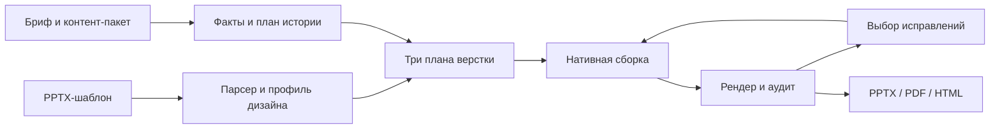

**ExpoSlides: аудит по ТЗ VK Tech и план подготовки к победной защите**

Дата: 27 сентября 2026. Основание: все семь страниц «4. VK Tech.pdf», текущее рабочее дерево, доступный локально снимок `origin/dev` и проверки, перечисленные ниже. Требования PDF рассматриваются как критерии будущего продукта, а не как разрешение публиковать, развёртывать или запускать платные API.

**Главный вывод.** У проекта есть сильная инженерная основа: рабочая файловая генерация, интерфейс, хранение, развитые механизмы восстановления ответов LLM, тесты и более новый структурный парсер. Наибольший прирост конкурсной ценности даст соединение этой основы с настоящей компоновкой слайдов, тремя вариантами оформления и встроенным визуальным аудитом. Сейчас наиболее зрелая часть продукта — заполнение текстовых полей. ТЗ требует цифрового дизайнера, который понимает правила незнакомого шаблона и создаёт по ним новые редактируемые слайды.

Победу нельзя гарантировать без результатов конкурентов и решения экспертов. Ниже — план, который закрывает явно указанные требования и создаёт убедительные доказательства качества. Приоритеты определены зависимостями и влиянием на результат; ограничение по числу разработчиков не закладывалось, поскольку код пишут агенты.

**Сначала нужно установить, какую версию продукта мы развиваем.**

| Источник | Что установлено | Как использовать |
| --- | --- | --- |
| Рабочая папка `/Users/aleksemanov/projects/ExpoSlides` | Ветка `dev`, HEAD `5ea439f`; до аудита 25 изменённых tracked-путей и 59 записей untracked, включая каталоги | Это фактически доступный локальный продукт; его изменения сохранены |
| Сохранённый локально `origin/dev` | Коммит `12f4fb1`; локальная ветка имеет 60 своих и не содержит 30 коммитов этой линии | Сопоставлять содержимое, а не оценивать готовность только по текущему HEAD или статусу untracked |
| `origin/dev:services/parsing-service/...` | Есть parser v2: assets, charts, SmartArt, groups, design tokens, patterns, components | Использовать как базу следующего этапа парсинга |
| `origin/dev:services/builder-service/app/network.py` и gateway | Сетевой builder и gateway уже написаны; feedback передаётся в content graph | Интегрировать и укреплять существующее; повторно реализовывать этот функционал не требуется |
| `artifacts/deploy-20260925/REPORT.md` | Описан реальный успешный сетевой прогон на `12f4fb1` и retry с feedback | Историческое свидетельство. В этом аудите сервер заново не проверялся |
| AGENTS/старые обзоры | Часть утверждений устарела: Docker/сеть уже имеют реализацию; текущий HTTP-клиент проверяет TLS | Правила работы сохранять, состояние продукта определять по коду |

Во время аудита `git fetch`, слияние, коммиты и деплой не выполнялись. `origin/dev` здесь означает доступный локально снимок, а не подтверждённое текущее состояние GitHub. Правильная первая задача — собрать один проверяемый интеграционный снимок, сохранив полезную работу обеих линий.

**Матрица соответствия ТЗ.** Номера страниц ниже — напечатанные в документе; обложка не нумерована. «Частично» означает наличие полезной реализации при существенном незакрытом требовании. Матрица учитывает также прочитанный код `origin/dev`, чтобы не объявлять отсутствующим уже написанное.

| Требование | Статус | Основание и следующий шаг |
| --- | --- | --- |
| Импорт PPTX, декомпозиция шаблона | Есть существенная основа | В новой линии parser v2 разбирает значительно больше, чем текст. Нужна проверка на официальных и отложенных неизвестных шаблонах |
| Токены дизайн-системы, типографика, композиционные паттерны | Частично | v2 уже извлекает tokens/patterns/components. Паттерны пока преимущественно основаны на типах placeholders; связь с генерацией слабая |
| Произвольный ранее неизвестный шаблон | Критический пробел | Генератор/сборщик работают с текстовыми placeholders; обычные text boxes и сложные группы не становятся универсальными редактируемыми слотами |
| Контент-пакет, краткий бриф, назначение | Частично | Основной UI принимает PPTX и текст/TXT. Нет полноценного набора источников, структурированных данных, изображений и явного назначения |
| План структуры до верстки | Есть внутри pipeline | Нужны независимый содержательный план, контроль покрытия и возможность просмотреть/изменить план в UI |
| Генерация графиков и таблиц | Нет в пользовательской сборке | Сохранение исходного chart/table не означает создание нового объекта из данных пользователя |
| Диаграммы, пиктограммы, SmartArt | Нет в генерации | Parser v2 умеет извлекать часть этих структур. Builder их не генерирует |
| Генерация изображений | Нет | Отдельная работа для финального профиля; ограничение специального пункта — до 20B |
| Три варианта верстки одного шаблона и контента | Нет | Независимые задания и альтернативные короткие подписи не реализуют три управляемые версии одной колоды |
| Аудит внутри pipeline | Частично, только текст/структура | Есть validation и проверки PPTX. Нет полноценного геометрического/визуального/контекстуального аудита готовых слайдов |
| Визуализация проблем и выбор исправлений пользователем | Нет | Нужны координаты замечаний, варианты исправления, выбор, новая версия и повторная проверка |
| Нативный редактируемый PPTX | Есть в поддерживаемом текстовом сценарии | Выход не является одним растровым изображением. Для новых charts/tables/diagrams требуется расширение builder |
| Экспорт PDF и HTML | Нет как пользовательский экспорт | PDF уже создаётся временно для preview; можно переиспользовать эту основу |
| 10–15 слайдов или заданное число | Частично | Есть верхний предел; число ограничено исходными слайдами. Один образец нельзя использовать повторно |
| Одна колода не более пяти минут | Не доказано для конкурсного сценария | Есть fast deadline и исторические прогоны; нет общего дедлайна пользовательского задания с аудитом и экспортом |
| Три шаблона × три варианта = девять результатов | Нет подтверждённой конкурсной матрицы | Официальные три шаблона и контент-пакет в рамках этого аудита не были предоставлены/идентифицированы |
| Версионирование skills/agents/prompts | Частично | Git есть, но промпты в Python-строках; нет полноценного manifest запуска с версиями |
| Модели с открытыми весами, Apache/MIT, до 35B | Основа подходящая, нужен паспорт | Текущий профиль Qwen соответствует основному направлению ТЗ; все реально используемые модели и fallback должны быть перечислены и проверены |
| Обязательный инференс VK для топ-10 | Требует подготовки | Текущий профиль HF/DeepInfra не подтверждает работу на endpoint VK |
| Python/TypeScript, перечисленный в ТЗ UI-стек | Частично | Backend Python; frontend сейчас vanilla JS/HTML/CSS. Для буквального соответствия рекомендуется React + TypeScript |
| Chrome/Firefox/Safari/Яндекс, заявленные ОС/версии | Не подтверждено | Node-тесты имитируют DOM, но не заменяют реальные браузеры |
| README, ARCHITECTURE, MODELS, AUDIT, запуск конфигом | Частично | README и отчёты есть; три специализированных документа и единый конфиг конкурсного запуска не найдены |
| Питч/живое демо до семи минут, фиксированная версия | Требует подготовки | Нужен воспроизводимый release и сценарий, показывающий ключевые требования |

**Что уже сделано хорошо и должно остаться в основе.**

1. **Рабочий путь до настоящего PPTX.** CLI изолирует одноимённые пакеты сервисов отдельными процессами, проверяет входы и результат, повторно открывает PPTX, затем атомарно публикует файл. Это правильная защита от частично созданного результата. См. `exposlides/cli.py:135`, `:245`, `:343` и `tests/test_end_to_end.py`.
2. **Устойчивость LLM-взаимодействия.** Ограниченные повторы, JSON Schema, типизированные ошибки, запрет дублирующихся JSON-ключей, локальные исправления с сохранением валидных полей, fast batching и deadline. См. `services/content-service/app/chains/llm.py:319`, `app/graph/fast.py:1042`, `app/graph/builder.py:45`.
3. **Обширные офлайн-регрессии.** Есть тесты повреждённых ответов, grounding, стилей, порядка слайдов, хранилища, гонок UI и завершения дочерних процессов. 1003 корневых теста прошли в этом аудите. Их количество характеризует проверенную область, но само по себе не измеряет полноту ТЗ.
4. **Полезный интерфейс.** Загрузка, встроенный пример, preview, несколько запусков, навигация по результатам и скачивание уже работают. Локально проверены открытие примера и настоящий предпросмотр пяти слайдов. Интерфейс визуально аккуратен; его стиль можно перенести при расширении сценария.
5. **Продуманная загрузка и сохранение.** Есть ограничения PPTX/ZIP, защита путей, Host/Origin и токен изменения данных. Постоянное хранилище сохраняет ссылки на версии через file-service; каталог записывается атомарно. См. `exposlides/web.py:146`, `:795`, `exposlides/file_storage.py`, `exposlides/web_catalog.py`.
6. **Новый парсер уже продвинулся в сторону ТЗ.** В `origin/dev` есть charts, SmartArt, группы, assets, tokens, patterns и components. Это самостоятельная ценная работа. Следующий шаг — передать эти сведения в планирование и верстку.
7. **Сетевая линия существует.** В `12f4fb1` builder действительно собирает PPTX, загружает файл и публикует результат; feedback применяется в графе. Код и отчёт подтверждают, что это больше не только roadmap.
8. **TLS проверяется.** Текущие sync/async HTTP-клиенты создаются с `verify=True`; переносить в новый аудит старое утверждение об отключённой проверке сертификатов было бы неверно.

**Подтверждённые проблемы с максимальным влиянием.**

**A. Проверка фактов недостаточно сильна.** Вызов настоящего `ContentValidator.validate()` без LLM принял все четыре намеренно ошибочных результата:

| Исходный смысл | Подставленный результат | Фактическая реакция |
| --- | --- | --- |
| Выручка 10 млн, прибыль 2 млн | Выручка 2 млн, прибыль 10 млн | `ok=True`, замечаний нет |
| Компания не хранит персональные данные | Компания хранит персональные данные | `ok=True`, замечаний нет |
| Выручка 10 млн рублей | Выручка 10 млрд рублей | `ok=True`, замечаний нет |
| Интеграция данных; следующий этап — обучение и расширение | Осталась только интеграция данных | `ok=True`, замечаний нет |

Это доказательство слабости валидатора, а не утверждение, что реальная модель уже выдала именно такие ответы. Причина — сравнение множеств чисел и пересечения слов вместо проверки связей «субъект → показатель → значение → единица → период → утверждение/отрицание». Знак отрицательного числа также не входит в текущий числовой токен. Основание: `app/utils/grounding.py:3`, `:27`; `app/utils/validation.py:116`. Эти файлы совпадают в рабочем дереве и `origin/dev`.

**B. Богатая структура шаблона теряется между слоями.** Fast-планировщик получает преимущественно индекс, тип слайда, типы текстовых полей и лимиты длины (`app/graph/fast.py:94`, `:400`). Информация о композиции, таблицах, картинках и отношениях объектов не превращается в полноценные решения дизайнера. В v2 `compute_patterns` группирует layout по набору типов placeholders и берёт геометрию первого layout; для разных композиций с одинаковым набором полей этого недостаточно. Обычные макеты без placeholders получают пустую сигнатуру.

**C. Контракт не умеет выразить нужную презентацию.** `template_slide_index` одновременно служит источником и идентичностью выходного слайда. Уникальность запрещает повторное использование образца. Выход — словарь текстовых placeholders. В нём нет естественного места для новых рядов данных диаграммы, таблиц, процессов, иллюстраций и трёх вариантов одной истории. Core builder в обеих изученных линиях остаётся тем же текстовым сборщиком.

**D. Проверки качества дают неполное чувство готовности.** Скорер считает подстроки и верхний предел слайдов. Для `fast-product-review-15` один слайд с `2026; 42 млн рублей; 18%; 27%` получает 100 баллов. Сам benchmark отдельно проверяет 15 слайдов, поэтому его проверка количества сильнее скорера, однако содержательность пятнадцати слайдов это всё равно не доказывает. Требуются факты, смысловое покрытие, визуальная оценка и адверсариальные отрицательные примеры.

**E. Есть разрыв между пользовательским и сетевым путями.** UI вызывает файловый CLI; gateway развивается отдельно. В прочитанном `origin/dev` обнаружены риски: асинхронный `sio.enter_room()` вызван без `await` (`ws_hub.py:8`), Kafka-consumer подтверждает событие после некоторых ошибок обработки (`kafka_consumer.py:55`), обновления статуса не защищены номером попытки (`:74`), скачивание файла проверяет наличие сессии без проверки принадлежности файла (`router/files.py:56`). Это результаты чтения кода; текущий сетевой сервис в этом аудите не запускался.

**F. Пять минут пока не охватывают весь пользовательский результат.** CLI `_run_stage()` не имеет общего таймаута (`exposlides/cli.py:151`). Web может сразу запускать до 50 заданий отдельными потоками/процессами (`web.py:647`), что создаёт конкуренцию за модель и конвертер. Статусы незавершённых заданий не переживают перезапуск. Одна очередь preview способна задерживать готовый результат за большим шаблоном.

**G. Мелкие заметные дефекты тоже важны на защите.** В историческом HF-прогоне были потеряны планы следующего квартала и итоговый фокус, сохранились номера вида `01 / 05`, `03 / 05`, `05 / 05` у трёхслайдового результата. Fast-промпт просит «короткое название темы» для TITLE, хотя рекомендованный критерий аудита из ТЗ — заголовок-вывод. Это надо закрыть наряду с крупными возможностями, а не полагаться на красивый первый слайд.

**H. В новом парсере воспроизведён отказ на обычных круговых диаграммах.** Целый `PPTXParser` из `origin/dev` проверен на трёх программно созданных PPTX: PIE и DOUGHNUT завершились `ValueError: chart has no category axis`; COLUMN_CLUSTERED импортирован успешно. Причина: `app/parsers/pptx/charts.py:94` обращается к свойству `category_axis`, которое у этих типов бросает исключение. Ошибка не перехватывается до верхнего уровня. Это первая конкретная регрессия, которую следует закрыть при интеграции v2. Тест `services/parsing-service/tests/test_pptx_charts.py:217` с безусловным `except Exception: pass` не доказывает устойчивость импорта.

**I. Наследование и редактирование стилей нуждаются в расширении.** Парсеры используют `prs.slide_layouts`, соответствующий первому master; v2 выбирает одну тему. Нужны реальные multi-master примеры. Builder `app/utils/text.py:21` размножает свойства первого run/paragraph: базовый стиль сохраняется, но смешанное форматирование и разные уровни абзацев теряются. Запрет небезопасного удаления slides из custom shows/sections сейчас разумен; при клонировании требуется явное обновление этих связей, а не снятие запрета без замены.

**Целевой продукт и архитектура.**

Пользовательский путь: **Материалы → План истории → Три варианта → Аудит → Выбранные исправления → Экспорт.** Для автоматического режима промежуточное подтверждение плана можно пропускать, сохраняя возможность вернуться к нему.



Границы программных слоёв важнее количества сервисов. Существующие parser/content/builder, CLI и сетевые адаптеры можно сохранить. Общая application-логика должна быть одной; адаптеры запускают одни и те же стадии и используют одинаковые контракты.

| Контракт | Обязательное содержимое | Для чего нужен |
| --- | --- | --- |
| `TemplateProfile` поверх существующего Presentation v2 | Палитра, типографика, поля/сетка, отношения объектов, композиционные паттерны, слоты, заблокированные элементы, поддержанные/неподдержанные возможности, уверенность извлечения | Делает правила шаблона доступными planner и audit; не требует выбрасывать parser v2 |
| `SourceBundle` / `FactRecord` | Идентификаторы источников и диапазоны текста; субъект, показатель, значение, единица, период, полярность; обязательность; данные таблиц/диаграмм; provenance assets | Проверяет смысл и происхождение содержимого |
| `ContentPlan` | Тезис и цель каждого слайда, обязательные факты, смысловые блоки, переходы, режим точного/максимального числа слайдов, покрытие исходника | Одна история для всех вариантов, до выбора координат |
| `DeckPlan` / `SlideInstance` | `variant_id`, независимый `slide_instance_id`, ссылка на source slide/layout/pattern, типизированные блоки text/table/chart/process/image, геометрия и токены | Разрешает повторное использование образца и создание новых редактируемых объектов |
| `AuditIssue` / `FixAction` | Rule ID/version, deterministic/contextual, severity, слайд/объект/bbox, наблюдение, expected/actual, source refs, уверенность, предлагаемое изменение | Объяснимые замечания, выбор исправлений и точечный повторный аудит |
| `RunManifest` | Хеши входов, версия кода/схем/промптов/моделей/правил, версии и хеши skills/agents/ролей/конфига графа, настройки, этапные времена, попытки, история исправлений, версии экспортов | Воспроизводимость и доказательства на защите |

Миграция должна быть явной: адаптеры существующего Presentation JSON v1/v2, новый контракт генерации с версией, понятная ошибка при неподдержанной версии. Все потребители, fixtures и документация обновляются совместно. Не превращать старый словарь `content[slide_index]` в многозначную структуру без версии и проверок.

**План исполнения для агентов.** «P0» означает критический путь, «P1» — обязательное завершение конкурсного продукта, «P2» — усиление после устойчивого полного сценария. P1 не означает факультативность пункта ТЗ.

| ID / приоритет | Работа | Зависит от | Критерий приёмки |
| --- | --- | --- | --- |
| W0 / P0 | Свести рабочую папку и `12f4fb1`, зафиксировать baseline и основной путь | — | Сохранены локальные изменения, parser v2, сеть и feedback; устранён отказ импорта PIE/DOUGHNUT; чистый воспроизводимый снимок; отдельные suites работают без внешнего LLM; baseline Ruff устранён отдельным проверяемым изменением |
| W1 / P0 | Утвердить общие контракты и разделить ContentPlan/DeckPlan | W0 | Схемы валидируют обычный текст, chart/table, повтор layout и три variants; legacy имеет явный адаптер; contract tests одинаковы для всех стадий |
| W2 / P0 | Довести профиль неизвестного шаблона | W1 | Поддержаны placeholders, обычные text boxes, группы, наследование master/layout/theme, декоративные и защищённые элементы; неизвестный шаблон не требует ручной разметки |
| W3 / P0 | Факты, смысловое покрытие, бриф/назначение | W1 | Четыре контрпримера из аудита отклоняются; обязательные тезисы сохранены во всех вариантах; пропуски/неуверенность видны пользователю; недостающие данные не выдумываются |
| W4 / P0 | Нативный compositor/builder с повторным использованием образцов, таблицами, графиками, схемами, пиктограммами и SmartArt | W1, базовый W2 | Из шаблона с 4 полезными образцами собираются 12 выходных слайдов; объекты редактируются; ссылки/медиа/стили целы после повторного открытия; поддержка SmartArt проверена отдельно |
| W5 / P0 | Три управляемые версии верстки | W3, W4 | Один набор обязательных фактов; три явно разные композиции; одинаковый стиль шаблона; различие определяется политиками верстки и проверяется в галерее |
| W6 / P0 | Аудит результата и точечные исправления | Контракт W1; полный сценарий после W4 | Проблемы привязаны к объектам и показаны поверх слайда; исправляются только выбранные; версия до правки доступна; повторный аудит не вносит регрессии |
| W7 / P1 | Пользовательский сценарий на React + TypeScript | W1; интеграция W3–W6 | Материалы/план/3 варианта/аудит/экспорт доступны без CLI; сохранены полезные состояния существующего UI; ошибки понятны |
| W8 / P1 | PDF/HTML/export versioning | W4 | Три формата отражают одну выбранную версию колоды; работают офлайн после скачивания; HTML содержит текст/SVG/таблицы; PPTX не растеризован целиком |
| W9 / P1 | Очередь, общий deadline, VK transport, состояние задач и устранение дефектов gateway | W0–W1 | Ограничена параллельность; есть отмена; исправлен `await enter_room`; временная ошибка не приводит к потере события; проверяется владение файлом; переходы защищены `attempt`; профиль VK проверен при наличии доступа |
| W10 / P1 | Внешние промпты/конфиги, модели и пакет воспроизводимости | W0; закрепление после W1 | README/ARCHITECTURE/MODELS/AUDIT соответствуют коду; модели, prompts, rules, skills, agents и конфиг графа версионированы; один конфиг воспроизводит demo |
| W11 / P1 финала | Генерация изображений | W2, W4, модельный паспорт | Изображение связано с темой и стилем; не вытесняет факты; модель соответствует специальному пределу 20B и разрешённой лицензии |
| W12 / P0 на всех этапах | Конкурсная матрица качества, скрытые шаблоны, живое демо | Начать после W0, завершить после W5–W11 | Девять результатов на официальном наборе; слепые прогоны; измерения полного времени; обзор всех слайдов; выпускной checklist пройден |

**Как распараллелить без конфликтов.** Агент-интегратор владеет W0/W1 и миграциями; агент парсинга — W2; агент содержания — W3; агент сборки — W4/W5; агент качества — W6/W12; агент интерфейса — W7/W8; агент эксплуатации — W9/W10. При ограниченном числе одновременно работающих агентов эти роли последовательно переиспользуются. Сначала согласуются схемы и примеры вход/выход, затем независимые реализации идут параллельно. Два агента не меняют один контракт одновременно. Каждый пакет заканчивается тестом поведения и реальным артефактом, если менялась PPTX-логика.

**Уточнение W2: универсальность шаблона.**

- Сохранять identity source slide/layout/shape и происхождение каждого токена. Отдельно вычислять effective style с учётом наследования и преобразований координат групп.
- Классифицировать элементы как содержательные слоты, повторяющиеся компоненты, декор и защищённые элементы. Низкая уверенность показывается в профиле; ручное подтверждение допустимо как исправление, но не как обязательная предварительная подготовка каждого неизвестного шаблона.
- Выделять композиционные отношения: колонки, выравнивание, расстояния, слой, контейнер, подчинённость подписи картинке. Две разные геометрии с одинаковыми placeholders должны оставаться разными паттернами.
- Сначала использовать детерминированные признаки OOXML, затем контекстуальную модель для неоднозначной роли. Визуальная модель не должна заменять структурные координаты приблизительной картинкой.
- Различать полезные образцы и инструкционные/технические страницы шаблона. Логотипы, legal notices и attribution по умолчанию сохранять; автоматическую нумерацию выводить из финального порядка, а неоднозначные статические подписи явно помечать.
- Фиксировать отсутствие нужных шрифтов до сборки. Подмена шрифта не должна молча выдаваться за точное соответствие корпоративному шаблону.

**Уточнение W3: достоверность и содержание.**

Проверять не все числа как неразличимое множество, а конкретные факты с источником. Ввести `required_facts` и `required_messages`; для опущенных необязательных данных хранить обоснование. Критические признаки — субъект/метрика, масштаб и единица, знак, дата/период, отрицание, сравнение, приблизительность. Любое вычисленное значение должно содержать формулу и ссылки на исходные данные.

Короткий бриф разрешает предложить структуру и нейтральные формулировки. Он не разрешает выдумывать выручку, рост, клиентов, сроки или результаты. При нехватке фактического основания слайд меняет композицию или запрашивает данные. Обязательные сообщения проверяются до верстки и повторно после сокращения текста. Заголовки отражают вывод, подтверждённый содержанием, а не добавляют неподтверждённую интерпретацию.

Форматы контент-пакета нужно взять из официального датасета. Первые адаптеры должны покрывать реально выданные текст, таблицы и медиа; поддержка всех возможных документов не является необходимым первым этапом.

**Уточнение W4: нативная верстка.**

Нужны минимум: text/title, bullets, KPI, comparison, timeline/process, table, bar/line/pie chart, image+caption, пиктограммы и поддерживаемые семейства SmartArt. Схемы, пиктограммы и SmartArt входят в базовую функциональность ТЗ; только text-to-image выделен в задачу для топ-10. Выбор зависит от смысла и доступных паттернов. Координаты, интервалы, шрифты и цвета задаются правилами шаблона; модель выбирает представление и содержание в допустимых пределах.

Клонирование образца требует полноценной работы с relationships: картинки, chart parts и embedded workbooks, notes, hyperlinks, внутренние ссылки между слайдами, sections/custom shows. Изменение chart на одном выходном слайде не должно менять второй экземпляр. Проверять уникальность новых частей, валидность ссылок, порядок и свойства после сохранения и повторного открытия.

При переполнении порядок действий: переформулировать без потери обязательных фактов → выбрать более вместительный разрешённый паттерн → разделить содержимое при допустимом числе слайдов → показать ограничение. Уменьшение кегля ограничено типографической шкалой и читаемостью. Лимит символов — предварительная оценка, итог решают измерение и рендер.

**Уточнение W5: три варианта, которые видит жюри.**

| Вариант | Ось различия | Пример одного и того же содержания |
| --- | --- | --- |
| A — тезис и доказательства | Последовательный рассказ, один вывод и компактные аргументы | Вывод о квартале + KPI + отдельный слайд следующего шага |
| B — данные и сравнение | Charts, таблицы и сопоставления вместо части текстовых перечислений | Тот же вывод и факты через диаграмму/таблицу, если источник содержит сравнимые данные |
| C — процесс и взаимосвязи | Дорожная карта, этапы, группировка и схемы | Те же планы и результаты организованы как этапы/причины/следствия без выдуманных причинных связей |

Во всех вариантах сохраняются обязательные факты, язык, назначение и дизайн-токены. Если для графика нет данных, B выбирает иной обоснованный паттерн. При одинаковом заданном числе слайдов меняются композиции и визуальные представления. Предлагаемый внутренний gate: различается доминирующая композиция хотя бы у половины содержательных слайдов плюс визуальное сравнение человеком. Это наша метрика, а не формулировка ТЗ.

**Уточнение W6: аудит как центральная демонстрация.**

| Группа | Первые проверки | Как избегать ложных срабатываний |
| --- | --- | --- |
| Структура | ZIP/relationships, открытие, пустые слайды, заглушки, нативность, дубли | Сравнивать структуру и содержание, не считать любой фон-картинку растровым слайдом |
| Геометрия | Выход за рамку, пересечение содержательных блоков, поля, выравнивание | Учитывать группы, rotation, clipping, иерархию и разрешённые наложения шаблона |
| Типографика/стиль | Шрифт, шкала кеглей, палитра, логотипы, подписи, контраст | Разрешать документированные исключения; для фото/градиента измерять фактический фон под текстом |
| Размещение текста | Обрезка, переполнение, длинные строки, нечитабельные подписи | Сопоставлять метрики layout и итоговый рендер; одного подсчёта символов недостаточно |
| Данные | Значения, единицы, подписи осей, легенда, масштаб, таблицы | Проверять исходные data refs и chart workbook, а не только видимый текст |
| Плотность | Буллеты, слова, размеры таблиц, число серий, заполненность | Пороговые значения приложения ТЗ оформить настраиваемыми правилами с обоснованными исключениями |
| Контекст | Заголовок-вывод, одна мысль, релевантность изображения, связь соседей, язык, опечатки | Отдельный contextual pass с версией модели, уверенностью и источниками; не выдавать его за детерминированную гарантию |

Для каждого замечания показывать выделенный объект, понятное объяснение и конкретный вариант исправления. Пользователь выбирает действия. Новая версия пересобирает только затронутую область, затем повторяет локальные и необходимые глобальные проверки. Невыбранные слайды и данные остаются семантически неизменными. История и сравнение до/после обязательны; единая кнопка «перегенерировать всё» не закрывает этот сценарий.

Преднамеренно повреждённый демонстрационный пример допускается только с явной пометкой, что это тест проверки. Отдельно показывается аудит реального нового результата.

**Время и устойчивость.**

Официальное требование — ≤300 секунд на одну колоду. Для продукта предлагается более строгая внутренняя цель: три варианта со стартовым аудитом готовы за те же 300 секунд после отправки материалов. Это цель проектирования, не уже достигнутый результат. Время ожидания выбора пользователя в неё не входит; отдельное время исправления измеряется отдельно.

| Работа в критическом пути | Проектный бюджет |
| --- | --- |
| Проверка входов, профиль шаблона; повторный шаблон берётся из кэша | 20 с |
| Извлечение фактов и общий план | 40 с |
| Контент и три плана верстки с совместным использованием результатов | 60 с |
| Нативная сборка и рендер | 55 с |
| Детерминированный и контекстуальный аудит | 55 с |
| Допустимый локальный repair, экспорт | 35 с |
| Резерв | 35 с |

Этот бюджет необходимо проверить на разрешённой модели и реальном VK endpoint. Ограниченная очередь, общий deadline, общие данные для трёх вариантов, кэш профиля и изображений, пакетные запросы и выборочный контекстуальный аудит важнее неограниченного параллелизма. Таймаут должен завершать дочерние процессы и сохранять понятное состояние; частичный результат нельзя выдавать за успешно прошедшую колоду.

**Модели и формальные условия.**

Официальная [карточка Qwen3.8-27B](https://huggingface.co/Qwen/Qwen3.8-27B), просмотренная 27 сентября, указывает открытые веса, Apache-2.0, 27B параметров языковой модели и нативное понимание изображений. Поэтому разумно сначала проверить возможность использовать предписанный Qwen также для контекстуального аудита слайдов. Доступность vision-input, structured output и лимитов нужно отдельно подтвердить у предоставленного VK endpoint: свойства модели не гарантируют свойства конкретного API.

Для финального профиля подключить инференс VK; каждый fallback также должен соответствовать ограничениям. Исторические GigaChat-замеры полезны как история разработки, но не являются доказательством допустимости конкурсной конфигурации или производительности Qwen.

Для text-to-image следовать более строгому специальному пределу 20B из пункта 3.1. Перед выбором зафиксировать реальную лицензию, открытость весов, число параметров, способ инференса, память, скорость и право использования результата. Конкретная image-модель в этом аудите не выбрана. Не предполагать, что генератор изображений, доступный агенту разработки, автоматически допустим внутри сдаваемого продукта.

Есть неоднозначности, которые стоит зафиксировать для организаторов: специальный предел image 20B против общего 35B; смысл поддержки SmartArt (настоящий объект либо согласованные нативные формы); список ОС/браузеров в части Safari на Windows; где начинается/заканчивается измерение пяти минут. До уточнения план принимает строгий вариант: 20B, нативные редактируемые объекты, фактические поддерживаемые пары ОС/браузер и полный путь до готовой колоды. В этом аудите сообщения организаторам не отправлялись.

**Как доказать качество до защиты.**

Собрать матрицу: 3 официальных шаблона × 3 представления; затем минимум 5 отложенных шаблонов, не использованных при разработке правил. Включить обычные text boxes, сложные группы, пустые placeholders, смешанные стили, длинные слова, кириллицу, таблицы, charts, внутренние ссылки, sections/custom shows и разное число исходных образцов.

Отдельный набор проверяет перестановки показателей, отрицания, единицы/масштабы, знаки, периоды, повторяющиеся одинаковые числа у разных сущностей, потерю нечисловых выводов и выдуманные сравнительные утверждения. Строки из брифа и шаблона с командами для модели обрабатываются как данные и не должны менять системные правила или запрашивать секреты.

| Проверяемое свойство | Предлагаемый выпускной gate |
| --- | --- |
| Полнота требований | Все обязательные пункты матрицы имеют код, тест и демонстрационный артефакт |
| Структура PPTX | Все финальные файлы повторно открываются; нет битых relationships; проверка в PowerPoint плюс автоматическая структурная проверка |
| Факты | 100% обязательных фактов сохранены; 0 выявленных неподтверждённых значений/перестановок/отрицаний на размеченном наборе |
| Неизвестные шаблоны | Слепая проверка без ручного редактирования входного PPTX; ограничения и отказы учтены в результатах |
| Редактируемость | Проверяются текст, таблица, chart и схема как объекты; редактирование данных chart меняет график |
| Визуальные дефекты | 0 критических дефектов в сдаваемых девяти колодах; ручной обзор каждого слайда, а не только титульного |
| Аудит | Все специально внедрённые поддерживаемые дефекты найдены; измерены ложные срабатывания на чистых шаблонах; исправление не создаёт новых критических дефектов |
| Три варианта | Ключевые факты одинаковы, композиции различимы, стиль соответствует шаблону; есть попарная галерея |
| Время | Каждый сдаваемый прогон ≤300 с на колоду; на расширенном наборе записаны p50/p95 и доля ошибок/таймаутов |
| Устойчивость | Отмена, 429, временный обрыв, рестарт worker, повторное событие и запоздалое событие имеют проверенное поведение |
| Воспроизводимость и сдача | Чистое окружение, закреплённые зависимости, release/tag, конфиг и manifest дают тот же процесс; вариативность LLM явно признаётся; экспертам обеспечен требуемый доступ к репозиторию без секретов |
| Браузеры | Актуальная и предыдущая версии требуемых браузеров на согласованных ОС; автоматические проверки на движках плюс ручной smoke в настоящих браузерах; эмуляция WebKit не выдаётся за весь Safari/Яндекс |

Числа 5 отложенных шаблонов, внутренний бюджет трёх вариантов и некоторые пороги выше — предлагаемые инженерные критерии, не дополнительные требования организаторов. Для p95 и успешности нужны повторные прогоны с достаточной выборкой; единичный запуск не служит оценкой вероятности успеха.

Офлайн-тесты остаются полностью без внешнего LLM. Живые сравнения запускаются отдельно, с явно заданной разрешённой конфигурацией и учётом затрат. Scorer дополняется редакторской и визуальной оценкой. Сохраняются результаты отказов, чтобы не получить картину только по удачным запускам.

**Сценарий семиминутной защиты.**

| Время | Что показать | Что доказывает |
| --- | --- | --- |
| 0:00–0:30 | Бизнес-проблема; загрузка незнакомого шаблона и контент-пакета, запуск | Реальная исходная задача и старт живого отсчёта |
| 0:30–1:15 | Палитра, типографика, найденные паттерны и защищённые элементы | Шаблон действительно разобран |
| 1:15–2:00 | Архитектура и общий план истории; источники фактов | Границы слоёв и контролируемое содержание |
| 2:00–4:30 | Коротко показать подготовленную честно обозначенную галерею 3×3 и устройство проверок, пока идёт живой запуск | Широта применимости и доказательства; галерея не выдаётся за текущую генерацию |
| 4:30–5:15 | Готовые три варианта живого запуска, переключение композиций | Выполнение ключевого требования и времени |
| 5:15–6:10 | Замечание аудита, источник/координаты, выбор правки, результат до/после | Аудит является частью продукта; человек управляет исправлением |
| 6:10–6:40 | PPTX в PowerPoint: изменение текста или данных графика; PDF/HTML | Нативная редактируемость и экспорт |
| 6:40–7:00 | Результаты на неизвестных шаблонах, ограничения, готовность к пилоту | Честная и измеримая готовность |

У живого результата может не быть замечаний — это нормально. Для показа конкретного правила иметь явно подписанный дефектный тестовый пример. Запасная запись до семи минут делается без монтажных склеек согласно ТЗ; она не подменяет заявление о живом успешном прогоне. Перед защитой прогоняется весь сценарий на том же endpoint, шрифтах и ресурсах.

**Ближайший законченный результат, после которого проект качественно меняется.**

На неизвестном PPTX с обычными текстовыми блоками и небольшим числом образцов получить 12 слайдов, включая новую таблицу и диаграмму из исходных данных; показать три варианта той же истории; подсветить хотя бы один корректно найденный дефект и исправить его по выбору пользователя; скачать редактируемый PPTX и согласованные PDF/HTML. До достижения этого результата следующий раунд косметики интерфейса или дополнительных эвристик сокращения текста имеет меньший приоритет.

**Фактически выполненные проверки и границы аудита.**

| Команда/действие | Результат |
| --- | --- |
| `UV_CACHE_DIR=/tmp/exposlides-audit-uv uv run --offline pytest` | В ограниченной песочнице: 987 passed, 16 failed за 13,10 с. Все 16 относились к тестам интерактивного ввода фиктивных ключей и недоступности `/dev/tty` |
| `UV_CACHE_DIR=/tmp/exposlides-audit-uv uv run --offline pytest --tb=short` | Повтор с разрешённым доступом к терминалу: **1003 passed за 13,37 с** |
| `UV_CACHE_DIR=/tmp/exposlides-audit-uv uv run --offline ruff check .` | **45 существующих замечаний**; полный gate сейчас не проходит |
| `UV_CACHE_DIR=/tmp/exposlides-audit-uv uv run --offline ruff check . --output-format concise` | Подтверждены те же 45: импорты, неиспользуемые импорты и одна лишняя f-строка |
| `UV_CACHE_DIR=/tmp/exposlides-audit-uv uv lock --check --offline` | Успешно, 73 пакета |
| `UV_CACHE_DIR=/tmp/exposlides-audit-uv uv run --no-sync python -` с четырьмя контрпримерами | Все четыре ошибочных результата приняты валидатором; код пробы ниже |
| `UV_CACHE_DIR=/tmp/exposlides-audit-uv uv run --offline python -m exposlides.web --port 8877` | Локальный сервер запущен; встроенный пример и реальный preview проверены в браузере; генерация LLM не запускалась |
| Чтение `git show origin/dev:...` | Проверены parser v2, сетевой builder, feedback, gateway и неизменность ключевых пробелов; suite этой версии заново не запускалась |
| `UV_CACHE_DIR=/tmp/exposlides-audit-uv uv run --offline python -` с parser v2, загруженным из Git в память | Реальные временные PPTX: PIE — отказ; DOUGHNUT — отказ; COLUMN_CLUSTERED — успешный импорт одного слайда. Проверен целый parser, репозиторий не изменялся |

Корневой pytest настроен на `tests/`. Service-level suites не следует считать автоматически проверенными этим результатом. Число 1072 из отчёта деплоя — исторический результат другого снимка; оно не заменяет текущие 1003.

`.env` и секреты не читались. Новые обращения к LLM, live benchmarks, серверные проверки и создание девяти конкурсных колод не выполнялись. Конкурсные шаблоны и контент-пакет не оценивались визуально: исходными материалами данного запроса были ТЗ и репозиторий. Просмотрены все страницы ТЗ, локальный интерфейс/preview и сохранённое изображение первого слайда исторического прогона; это не равнозначно визуальному аудиту всех прежних результатов.

Создан только этот документ. Исходный код, зависимости, существующие отчёты и пользовательские изменения не редактировались.

**Воспроизведение контрпримеров валидатора** — выполнять из корня проекта; это локальный тест без загрузки конфигурации LLM:

```bash
UV_CACHE_DIR=/tmp/exposlides-audit-uv uv run --no-sync python - <<'PY'
import asyncio
import sys

sys.path.insert(0, 'services/content-service')
from app.models.presentation import PresentationData, SlideData, PlaceholderData
from app.models.graph_state import GeneratedSlideContent
from app.utils.validation import ContentValidator

presentation = PresentationData(slides=[SlideData(
    index=1,
    placeholders=[PlaceholderData(
        idx=0, placeholder_type='BODY', text='Исходный текст', max_length=500,
    )],
)])
cases = [
    ('metric_swap',
     'Выручка компании составила 10 млн рублей, прибыль компании составила 2 млн рублей.',
     'Выручка компании составила 2 млн рублей, прибыль компании составила 10 млн рублей.'),
    ('negation_lost',
     'Компания не хранит персональные данные пользователей. Платформа поддерживает интеграцию.',
     'Компания хранит персональные данные пользователей. Платформа поддерживает интеграцию.'),
    ('nonnumeric_section_lost',
     'Платформа поддерживает интеграцию корпоративных данных. '
     'Следующий этап — обучение сотрудников и региональное расширение.',
     'Платформа поддерживает интеграцию корпоративных данных.'),
    ('unit_changed',
     'Выручка компании составила 10 млн рублей. Платформа поддерживает интеграцию данных.',
     'Выручка компании составила 10 млрд рублей. Платформа поддерживает интеграцию данных.'),
]

async def main():
    for name, source, result in cases:
        report = await ContentValidator.validate(
            presentation,
            {1: GeneratedSlideContent(placeholders={'0': result})},
            {1}, source,
        )
        print(name, report.model_dump())

asyncio.run(main())
PY
```

Для текущей проверенной версии каждая строка заканчивается `{'ok': True, 'issues': []}`. После исправления W3 эти примеры должны стать отрицательными регрессионными тестами с предметными причинами отказа.
